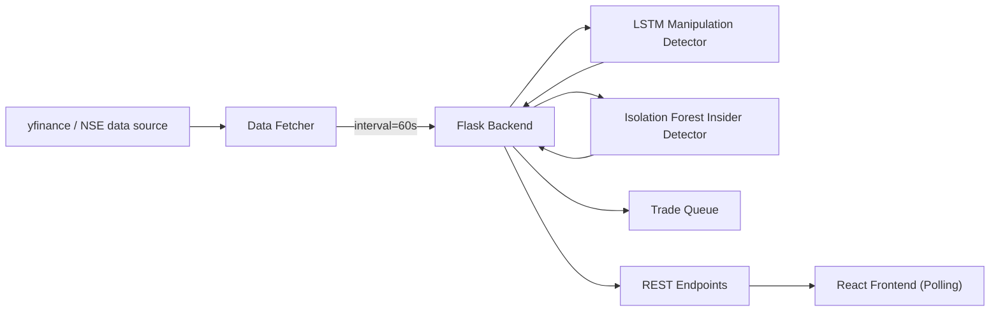
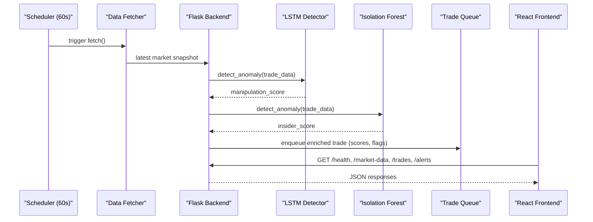

# ApexAI

AI-powered market surveillance with a Python Flask backend and a modern React frontend. The system detects spoofing/layering and insider anomalies from live-like market data using an LSTM-based manipulation detector and an Isolation Forest anomaly detector.

<p align="left">
  <a href="https://github.com/VineetKamath/ApexAI"></a>
  
  
  
  
  
  
</p>

## Table of Contents

1. Overview
2. Architecture
3. System Flow
4. Data Model and Processing
5. Backend API Reference
6. Frontend Behavior
7. Setup and Quick Start
8. Configuration
9. Development and Testing
10. Deployment
11. Security and Hardening
12. Troubleshooting
13. Roadmap

## 1. Overview

The platform ingests market index data at a fixed cadence, enriches it with model-based risk scores, and exposes both snapshots and recent trades/alerts via a REST API. The frontend polls these endpoints on short intervals to drive a live dashboard.

## 2. Architecture



Key components:
- Data Fetcher: pulls index data for NIFTY 50, SENSEX, BANKNIFTY at configurable intervals.
- Flask Backend: orchestrates fetching, model inference, and exposes REST endpoints.
- Models: LSTM for manipulation scoring and Isolation Forest for insider anomaly detection.
- Frontend: React application polling the REST endpoints for health, market data, trades, and alerts.

## 3. System Flow



## 4. Data Model and Processing

Trade enrichment (computed in `backend/app.py`):

```json
{
  "trade_id": "string",
  "symbol": "NIFTY 50 | SENSEX | BANKNIFTY",
  "price": 24579.0,
  "volume": 5000,
  "timestamp": "ISO-8601",
  "manipulation_score": 0.0,
  "insider_score": 0.0,
  "latency_flag": false,
  "risk_level": "HIGH | LOW"  
}
```

Notes:
- `risk_level` is derived from `max(manipulation_score, insider_score)` vs the current `risk_threshold`.
- `latency_flag` compares current time to the trade timestamp with a 100 ms budget.

## 5. Backend API Reference

Base URL: `http://localhost:5000`

- GET `/health`
  - Returns service health, model readiness, and whether the market fetcher is active.
- GET `/status`
  - Returns number of connected clients (internal set), fetcher running state, symbols, risk threshold, trade queue size, and timestamp.
- GET `/market-data`
  - Returns the latest snapshot per symbol. Falls back to mocked data if source data is unavailable.
- GET `/trades`
  - Returns last 25 enriched trades. Synthesizes a batch when queue is empty (for demo/testing).
- GET `/alerts`
  - Returns up to 20 recent alerts derived from medium/high risk trades. Synthesizes alerts if none are present.
- POST `/config/risk_threshold`
  - Request body: `{ "threshold": number between 0.0 and 1.0 }`
  - Updates the in-memory risk threshold.
- POST `/toggle-mock`
  - Request body: `{ "use_mock": true|false }` (optional; toggles if omitted)
  - Enables or disables mocked data mode at the fetcher.
- GET `/test-nse`
  - Attempts direct fetch from the NSE endpoints for the three indices and reports per-symbol status.

Error codes: endpoints return JSON with a `success` flag or appropriate HTTP status code and an `error/message` field on failure.

## 6. Frontend Behavior

- Location: `frontend/`
- Build tool: Vite with React 18 and TailwindCSS.
- Polling intervals (see `frontend/src/App.jsx`):
  - `/health`: every 5 seconds
  - `/market-data`: every 10 seconds
  - `/trades`: every 10 seconds
  - `/alerts`: every 15 seconds
- Backend URL: `http://localhost:5000` (hardcoded in `App.jsx` for this demo). Adjust for deployments behind proxies or different ports.

## 7. Setup and Quick Start

Prerequisites: Python 3.10+, Node.js 18+

```bash
# Clone
git clone https://github.com/VineetKamath/ApexAI.git
cd ApexAI

# Backend (Terminal A)
cd backend
python -m venv venv
venv\Scripts\activate   # Windows
# source venv/bin/activate   # macOS/Linux
pip install -r requirements.txt
python app.py

# Frontend (Terminal B)
cd ../frontend
npm install
npm run dev
```

URLs:
- Backend: `http://localhost:5000`
- Frontend Dev Server: `http://localhost:3000`

Windows helper: `backend\start_backend.bat`.

## 8. Configuration

- Risk threshold (default `0.7`): `POST /config/risk_threshold` with `{ "threshold": 0.8 }`.
- Data refresh interval: edit `market_fetcher.start_fetching(interval=60)` in `backend/app.py`.
- CORS: enabled broadly via `flask_cors.CORS(app)`; adjust for production.
- Frontend backend URL: update fetch URLs in `frontend/src/App.jsx` if needed.

## 9. Development and Testing

Backend tests:

```bash
cd backend
python test_backend.py
```

Recommended practices:
- Create a new virtual environment when changing Python versions.
- Run the backend first so the frontend health checks succeed.
- Use the mocked data mode for UI development when external data is unavailable: `POST /toggle-mock`.

## 10. Deployment

Frontend production build:

```bash
cd frontend
npm run build
```

Backend with Gunicorn (example):

```bash
cd backend
pip install gunicorn gevent
gunicorn -w 4 -k gevent -b 0.0.0.0:5000 app:app
```

Reverse proxy considerations:
- Terminate TLS at the proxy (Nginx/Apache), forward to Flask port.
- Set appropriate CORS and cache headers for `/market-data`, `/trades`, and `/alerts`.

## 11. Security and Hardening

- Set `SECRET_KEY` via environment variable in production.
- Restrict CORS origins to known frontends.
- Rate-limit write endpoints (e.g., `/config/risk_threshold`, `/toggle-mock`).
- Log and monitor anomaly rates, queue sizes, and error rates.

## 12. Troubleshooting

Common issues:
- Frontend shows disconnected state
  - Ensure backend is running and reachable at `http://localhost:5000`.
  - Check browser console network tab for failing requests and CORS errors.
- No data in dashboard
  - Enable mocked data via `POST /toggle-mock`.
  - Inspect backend logs for fetch failures or exceptions.
- Port conflicts
  - Change Flask port in `app.py` or the frontend dev server port via Vite config.

Diagnostics:

```bash
curl http://localhost:5000/health | jq .
curl http://localhost:5000/status | jq .
```

## 13. Roadmap

- WebSocket streaming to replace HTTP polling in the UI.
- Persistent storage and historical analytics.
- Authentication and RBAC for configuration endpoints.
- Dockerized deployment and CI/CD automation.
- Additional models and feature engineering for market microstructure.

---

Educational and demonstration purposes for market surveillance scenarios.
